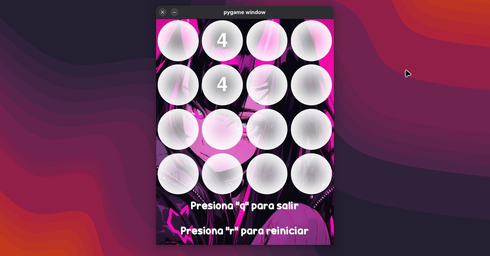
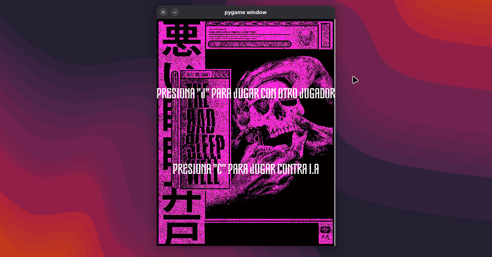
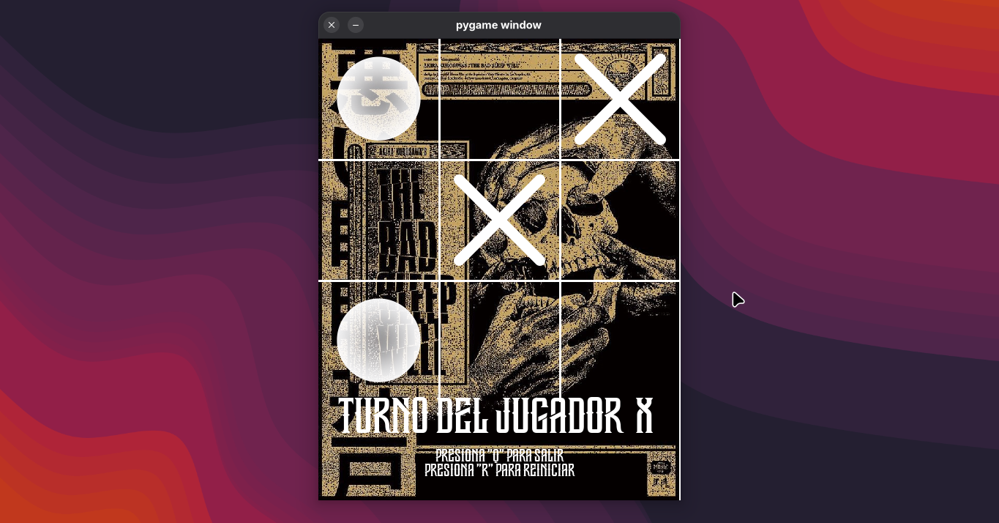

# Pygame-App
A Python desktop application implementing the minimax algorithm to create an unbeatable AI opponent in tic-tac-toe.
# Execution Instruccions
Install dependency
```
pip install pygame
```
Execute in memorama/ or tic_tac_toe/:
```
python main.py
```
# In Action Screenshots



